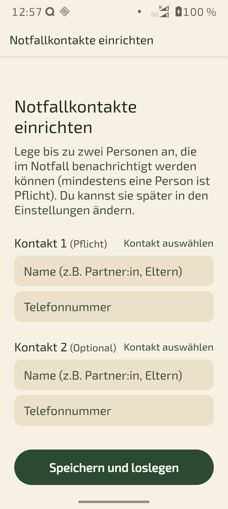
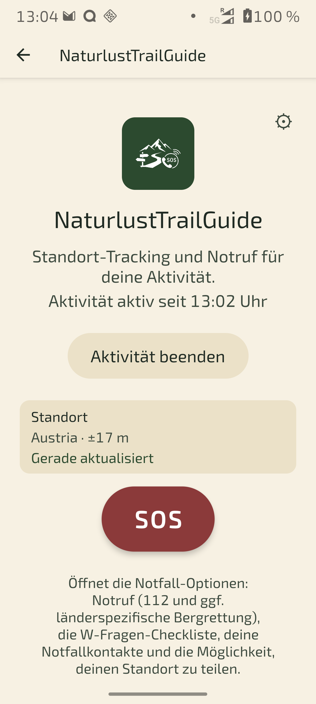
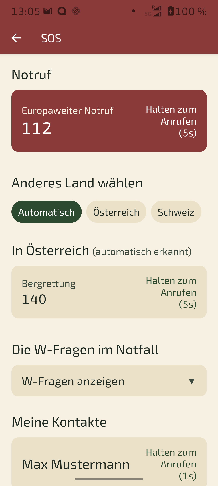

[Deutsch](README.md) | [English](README.en.md) | [Änderungsprotokoll](#änderungsprotokoll) | [Wichtiger Hinweis](#wichtiger-hinweis)

# NaturlustTrailGuide (NTG)

**Deine Sicherheit unterwegs. Deine Daten bleiben deine.**

Eine Sicherheits-App für Wanderer, Bergsteiger und Radfahrer: Standort-Tracking läuft nur während einer aktiven Tour, wird bei normalem Abschluss sofort und unwiderruflich gelöscht – und im Notfall stehen Notruf, Checkliste, Notfallkontakte und Standort-Teilen sofort bereit.

Mehr Infos, der vollständige Erklärtext und ein Kontaktformular: **[naturlust.net/trailguide-app](https://naturlust.net/trailguide-app/)**

---

## Grundprinzip

Startest du eine Aktivität, zeichnet die App im Hintergrund deinen Standort auf – auch bei gesperrtem Display. Kommst du sicher zurück, werden mit einem Klick alle Standortdaten sofort gelöscht. Es sammelt sich also **keine Bewegungshistorie** an. Nur wenn tatsächlich ein Vorfall vorlag, entscheidest du dich bewusst dafür, die Daten zu behalten.

## Features

- **Notruf ohne Umwege**: 112 immer verfügbar, plus automatisch erkannte, länderspezifische Bergrettungsnummer (aktuell AT, CH, SK, PL, CZ, IT, ES, BG) – die Ländererkennung funktioniert komplett **offline**. In Grenzregionen lässt sich das Land manuell übersteuern (Österreich/Schweiz).
- **Halten-Geste statt Antippen**: Ein Notruf wird erst nach 5 Sekunden bewusstem Halten ausgelöst – schützt vor Fehlbedienung.
- **W-Fragen-Checkliste**: Aufklappbare Erinnerung an die wichtigsten Angaben für den Notruf.
- **Notfallkontakte**: Bis zu zwei dauerhafte Kontakte (mindestens einer Pflicht) plus ein optionaler Kontakt nur für die aktuelle Tour.
- **Standort teilen**: Einmaliger Standort-Link oder ein laufend aktualisierter Live-Standort-Link über einen eigenen Relay-Server.
- **GPX-Export**: Aufgezeichnete Wegpunkte bei Vorfällen lassen sich als GPX-Datei per Mail versenden oder über beliebige Apps teilen.
- **SOS erst nach Tour-Start**: Der Notfall-Zugang ist gesperrt, solange keine Aktivität läuft – schließt versehentliche Notrufe aus.
- **Akku-Warnung**: Fällt der Akkustand während einer aktiven Tour unter 15%, meldet sich die App mit Ton.
- **Netz-wieder-da-Hinweis**: Nach einem Verbindungsverlust erinnert ein Hinweis mit Ton daran, sobald wieder Empfang da ist.
- **Neustart-Erinnerung**: Wurde das Gerät während einer laufenden Aktivität neu gestartet, erinnert eine Benachrichtigung daran, die App wieder zu öffnen und das Tracking fortzusetzen.
- **Mehrsprachig**: Deutsch/Englisch, automatisch nach Gerätesprache.

## Screenshots

| Ersteinrichtung | Aktive Tour | SOS-Screen |
|---|---|---|
|  |  |  |

Weitere Screenshots mit Erklärungen im Ordner [`screenshots/`](screenshots/) und auf der [Projektseite](https://naturlust.net/trailguide-app/).

## Technischer Aufbau

- **App**: React Native / Expo (SDK 57), TypeScript, expo-router
- **Standort-Tracking**: expo-location + expo-task-manager (Hintergrund-Tracking)
- **Lokale Daten**: expo-sqlite (Touren, Kontakte, Wegpunkte), react-native-mmkv (Einstellungen)
- **Ländererkennung**: Natural-Earth-Länderdaten (1:50m) + Turf.js, vollständig offline
- **Live-Standort-Link**: Cloudflare Worker + Workers KV ([`server/`](server/))

## Entwicklung

```bash
npm install
cp .env.example .env   # ggf. anpassen
npm run android         # oder: npm run ios / npm start
npm test
```

### Relay-Server (Live-Standort-Link)

```bash
cd server
npm install
cp wrangler.toml.example wrangler.toml
npx wrangler kv namespace create LOCATION_KV   # ID in wrangler.toml eintragen
npm run dev              # lokale Entwicklung
npm run deploy           # Deployment zu Cloudflare
```

## Änderungsprotokoll

Bezieht sich auf die Versionsnummer der App (`app.json`/`package.json`).

### 1.0.2
Ausgelöst durch die zweite Vergleichsmessung: eine Radtour mit parallel laufender Garmin-Uhr und einem zweiten, ebenfalls aufzeichnenden Rad (29.09.2026). Der Genauigkeitsfilter aus 1.0.1 hat gehalten – die Abweichung fiel von 129% auf 2,3%. Die genaue Auswertung zeigte dann aber, dass diese 2,3% täuschen: Sie sind die Summe zweier Fehler, die sich gegenseitig fast aufheben.
- **Standorte werden alle 10 statt alle 30 Sekunden erfasst.** Dünnt man den Referenztrack auf den bisherigen Abstand aus, verliert er 7,2% seiner Länge: Bei Radgeschwindigkeit liegen zwischen zwei Messungen über 150 Meter, und jede Kurve dazwischen wird zur Geraden. Auf 10 Sekunden sind es nur noch 2,8%. Das Rauschen von 5,3% hat diesen Verlust bisher überdeckt, sodass die Gesamtstrecke fast richtig aussah.
- **Plausibilitätsprüfung für Standorte.** Der Genauigkeitsfilter greift nur, wenn das Gerät seine Unsicherheit selbst zugibt – und das tut es nicht immer. Auf dieser Tour kamen Sprünge von 470 bis 834 Metern durch, gemeldet mit unauffälliger Genauigkeit; der größte entspräche 163 km/h auf dem Fahrrad. Solche Fehlortungen sind nur an der Bewegung zu erkennen, nicht an der gemeldeten Qualität. Ist ein Standort vom letzten guten aus nur mit über 90 km/h erreichbar, wird er verworfen. Wichtiger als die Kilometerzahl ist dabei der Ernstfall: Diese Sprünge gingen bisher auch an den Live-Standort-Link, ein Verfolger sah die Position mehrere hundert Meter neben der Route.
- **Höhendaten werden aufgezeichnet.** Bisher speicherte die App keine Höhe, obwohl Android sie mitliefert – im Export der Radtour hatte kein einziger von 215 Punkten eine Höhenangabe, während die Referenz +400/−380 m auswies. Für eine Bergsport-App war das eine Lücke. Weil die per GPS gemessene Höhe stärker schwankt als die Position, werden nur Änderungen über 10 Meter als echter Anstieg gezählt; ohne diese Schwelle käme selbst auf einer Fahrt durch die Ebene ein dreistelliger Wert zusammen.
- **Streckenlänge und Höhenmeter in „Meine Aktivitäten".** Dort standen bisher nur die Dauer und die Anzahl der GPS-Punkte – eine technische Zahl, die über die Tour nichts sagt.
- **Die Genauigkeit steht jetzt im GPX-Export.** Bei der Auswertung der Radtour ließ sich nicht mehr klären, welche Genauigkeit die verbliebenen Ausreißer gemeldet hatten: Der Wert lag in der Datenbank, fehlte aber in der exportierten Datei.

### 1.0.1
Ausgelöst durch einen Vergleich einer echten Tour mit einer parallel laufenden Garmin-Uhr (27.09.2026):
- **Genauigkeitsfilter für Standortdaten.** Im Hintergrund drosselt Android das GPS und liefert regelmäßig Schätzwerte aus Mobilfunk- oder WLAN-Ortung. Ungefiltert erzeugten die Sprünge von mehreren hundert Metern: Bei der Vergleichsmessung kamen 21,95 km statt der tatsächlich gelaufenen 9,59 km zustande, rund ein Drittel davon aus 19 einzelnen Ausreißern. Gravierender als die falsche Distanz war die Folge für den Ernstfall – ein geteilter Standort konnte mehrere hundert Meter daneben liegen. Punkte, die schlechter als 50 m gemeldet werden, werden jetzt verworfen. Bleibt der Empfang länger als fünf Minuten schlecht, wird trotzdem ein grober Punkt aufgezeichnet: Ein ungenauer Standort ist im Notfall besser als eine Lücke.
- **Es kann nur noch genau eine Aktivität aktiv sein.** Bisher legte die App den Datenbankeintrag an, *bevor* sie nach der Standortberechtigung fragte. Da Android dafür eine eigene Systemseite öffnet und die App dabei pausiert, landete der Nutzer wieder auf dem Startbildschirm und tippte erneut – und hatte zwei aktive Aktivitäten. Die ältere wurde unsichtbar, alle weiteren GPS-Punkte wanderten in die neuere, und die erste Tour brach scheinbar mitten im Lauf ab. Ein Unique-Index in der Datenbank macht das jetzt technisch unmöglich.
- **Zweistufiger Startbildschirm.** Fehlt die Berechtigung, erklärt Schritt 1 den Zweck und bietet nur „Standortzugriff erlauben" an – ohne dass schon eine Aktivität entsteht. Nach der Rückkehr aus den Systemeinstellungen wechselt der Bildschirm von selbst auf Schritt 2 und sagt ausdrücklich, dass jetzt noch einmal getippt werden muss.
- **Der Live-Standort-Link nennt die Genauigkeit.** Wer den Link verfolgt, sah bisher nur eine Stecknadel und musste sie für exakt halten. Jetzt steht dabei, ob der Standort genau ist oder nur ein Umkreis – wer sucht, weiß damit, ob er einen Punkt oder ein Gebiet vor sich hat. Das Alter der Meldung steht in Minuten statt in Sekunden und wird ab zehn Minuten deutlich hervorgehoben.
- Fehlerbehebung: Der Zustand wird jetzt neu aus der Datenbank gelesen, wenn die App aus dem Hintergrund zurückkehrt. Vorher konnte der Startbildschirm „Aktivität starten" anzeigen, obwohl längst eine lief.
- Fehlerbehebung: Scheitert das Stoppen der Standortaufzeichnung, wird die Aktivität trotzdem sauber beendet. Vorher blieb sie in so einem Fall dauerhaft aktiv.

### 1.0.0
Erste öffentliche Version, angeregt durch das Gespräch mit dem Österreichischen Alpenverein (Abteilung Bergsport):
- Akku-Warnung während einer aktiven Tour, sobald der Akkustand unter 15% fällt (mit Ton).
- Hinweis mit Ton, sobald nach einem Verbindungsverlust wieder Netzempfang verfügbar ist.
- Erinnerung nach einem Geräte-Neustart, falls dabei noch eine Aktivität lief – die App muss danach manuell wieder geöffnet werden, um das Tracking fortzusetzen (bewusst kein automatischer Neustart im Hintergrund, um zusätzliche, sensible Berechtigungen zu vermeiden).
- Fehlerbehebung: Fand die App beim Start eine bereits laufende Aktivität vor (z.B. nach einem Geräte-Neustart), wurde das Standort-Tracking bisher nicht automatisch fortgesetzt.

### 0.1.0
Erste Version:
- Standort-Tracking im Hintergrund während einer aktiven Aktivität, automatische Löschung aller Standortdaten bei normalem Tourende.
- SOS-Screen: 112 immer verfügbar, automatische offline Ländererkennung mit länderspezifischer Bergrettungsnummer (AT, CH, SK, PL, CZ, IT, ES, BG), manuelle Länderauswahl für Grenzregionen (Österreich/Schweiz).
- Halten-Geste (5 Sekunden) für Notrufe, schützt vor Fehlbedienung.
- Aufklappbare W-Fragen-Checkliste für den Notruf.
- Dauerhafte Notfallkontakte (max. 2, mindestens einer Pflicht) plus ein optionaler Kontakt nur für die aktuelle Tour, Auswahl auch direkt aus dem Adressbuch.
- Standort teilen als einmaliger Link oder als laufend aktualisierter Live-Standort-Link über einen selbst gehosteten Cloudflare-Worker-Relay.
- "Meine Aktivitäten": Übersicht aller Touren mit erhaltenen Daten (nach einem Vorfall), GPX-Export per Mail oder Teilen-Funktion, einzelnes oder komplettes Löschen.
- "Infos zur App" mit Kontaktangaben und Link zur Projektseite.
- Funktion "App in Werkszustand zurücksetzen" für einen sauberen Neustart.
- Deutsch und Englisch, automatisch nach Gerätesprache.

## Wichtiger Hinweis

NaturlustTrailGuide ist ein privates Projekt und ersetzt keine offiziellen Notfall- oder Rettungsdienste. Die 112 bleibt in jedem Zweifelsfall die zuverlässigste Wahl. Die Nutzung der App erfolgt auf eigene Gefahr; aus der Nutzung können gegenüber dem Urheber keine rechtlichen Ansprüche geltend gemacht werden.

Diese App wurde zusammen mit Claude.ai entwickelt.

## Datenschutz

Siehe [PRIVACY.md](PRIVACY.md) für die Datenschutzerklärung.

## Lizenz

[MIT](LICENSE) – Stephan Rösner ([Naturlust.net](https://naturlust.net))
